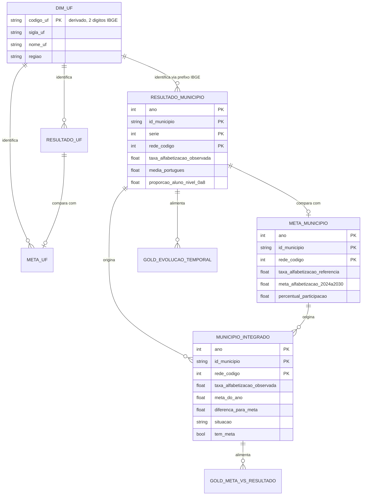
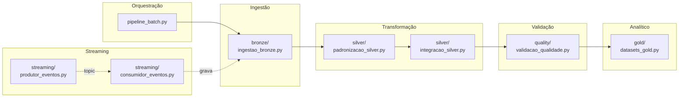
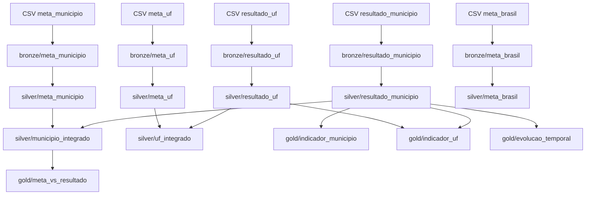
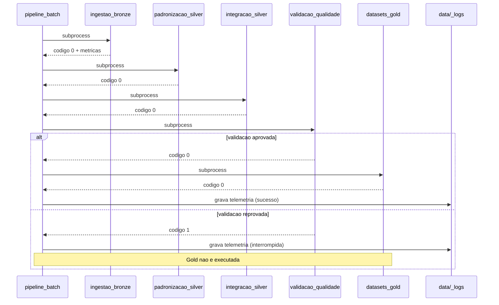
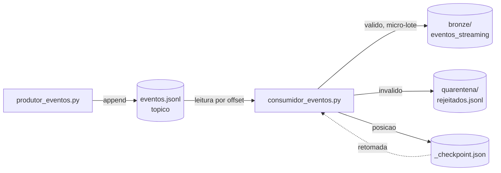

# Documento de Arquitetura

**Pipeline Híbrido para Análise da Alfabetização no Brasil**
Tech Challenge — Fase 2

Documento técnico da solução. Descreve o modelo de dados, os contratos entre camadas, as regras de transformação e a rastreabilidade dos requisitos.


---

## Sumário

1. [Visão geral](#1-visão-geral)
2. [Modelo de dados](#2-modelo-de-dados)
3. [Arquitetura de componentes](#3-arquitetura-de-componentes)
4. [Contratos entre camadas](#4-contratos-entre-camadas)
5. [Regras de transformação](#5-regras-de-transformação)
6. [Linhagem de dados](#6-linhagem-de-dados)
7. [Fluxo de execução](#7-fluxo-de-execução)
8. [Padrões de projeto aplicados](#8-padrões-de-projeto-aplicados)
9. [Arquitetura de streaming](#9-arquitetura-de-streaming)
10. [Modelo de validação](#10-modelo-de-validação)
11. [Rastreabilidade de requisitos](#11-rastreabilidade-de-requisitos)
12. [Evolução da arquitetura](#12-evolução-da-arquitetura)

---

## 1. Visão geral

A solução implementa a **Arquitetura Medalhão** com ingestão híbrida, sobre dados públicos do INEP referentes ao Indicador Criança Alfabetizada.

### Princípios de projeto

| Princípio | Como se manifesta |
|---|---|
| **Imutabilidade da origem** | A Bronze nunca altera o dado recebido; correções ocorrem a jusante |
| **Idempotência** | Cada etapa limpa seu destino antes de gravar; reexecutar produz o mesmo estado |
| **Falha explícita** | Erro de qualidade encerra o processo com código diferente de zero |
| **Preservação de exceções** | Registros incompletos são marcados, nunca descartados nem imputados |
| **Proporcionalidade** | A tecnologia é dimensionada ao volume real, não ao volume hipotético |
| **Rastreabilidade** | Toda linha carrega origem e momento de ingestão |

### Camadas e responsabilidades

| Camada | Responsabilidade | O que **não** faz |
|---|---|---|
| Bronze | Persistir a fonte com fidelidade | Não converte tipos, não corrige, não filtra |
| Silver — padronização | Tipar, renomear, normalizar chaves | Não junta tabelas |
| Silver — integração | Juntar e derivar comparações | Não agrega, não formata para consumo |
| Gold | Agregar e modelar para consumo | Não corrige dado, não valida |
| Qualidade | Verificar invariantes | Não altera dado |

A separação da Silver em duas etapas é deliberada: torna distinguível uma falha de tipagem de uma falha de junção.

---

## 2. Modelo de dados

### 2.1 Entidades e relacionamentos



### 2.2 Chaves naturais

| Tabela | Chave natural | Cardinalidade |
|---|---|---|
| `resultado_municipio` | `ano + id_municipio + serie + rede_codigo` | 23.995 |
| `resultado_uf` | `ano + sigla_uf + serie + rede_codigo` | 145 |
| `meta_municipio` | `ano + id_municipio + rede_codigo` | 10.704 |
| `meta_uf` | `ano + sigla_uf + rede_codigo` | 54 |
| `meta_brasil` | `ano + rede_codigo` | 3 |
| `municipio_integrado` | `ano + id_municipio + rede_codigo` | 10.896 |
| `uf_integrado` | `ano + sigla_uf + rede_codigo` | 49 |

Todas verificadas quanto à unicidade pelo módulo de qualidade. Nenhuma apresenta duplicidade.

### 2.3 Domínio da coluna `rede`

A codificação difere entre tabelas de resultado (numérica) e de meta (textual). O mapeamento foi estabelecido por inferência a partir dos dados, na ausência de dicionário na fonte.

| Código | Texto equivalente | `rede_nome` | Evidência |
|---|---|---|---|
| 2 | Estadual | `estadual` | Componente da agregação |
| 3 | Municipal | `municipal` | Coincide com a taxa da meta municipal em 100% de 5.352 casos |
| 5 | Pública | `publica` | Sempre entre os valores das redes 2 e 3, em 1.018 municípios verificados |
| 0 | — | `nao_identificada` | Somente 2024, 398 municípios, todos da Bahia; duplica a rede 3 |
| — | não mapeado | `desconhecida` (−1) | Reservado; dispara alerta na padronização |

### 2.4 Domínio da coluna `situacao`

Classificação derivada, criada na integração.

| Valor | Condição | Ocorrências |
|---|---|---|
| `atingiu` | Meta existe e diferença ≥ 0 | 2.788 |
| `abaixo` | Meta existe e diferença < 0 | 2.444 |
| `ano_anterior_a_trajetoria` | `ano` < 2024 | 5.302 |
| `municipio_sem_meta` | `tem_meta` = falso | 242 linhas / 148 municípios |
| `meta_do_ano_ausente` | Tem meta, mas o ano específico é nulo | 120 |

As três últimas categorias representam ausências de causas distintas. Colapsá-las em um único rótulo destruiria informação relevante para decisão de política pública.

### 2.5 Faixas de valor

| Coluna | Domínio | Verificado |
|---|---|---|
| `taxa_alfabetizacao_observada` | 0 a 100 (percentual) | Sim |
| `media_portugues` | 500 a 1000 (escala Saeb) | Sim |
| `id_municipio` | 7 dígitos numéricos | Sim |
| `ano` | 2023, 2024 | — |
| `serie` | 2 (constante) | — |
| `percentual_participacao` | 0 a 100 | — |

**Ponto de corte de alfabetização:** 743 pontos na escala Saeb.

---

## 3. Arquitetura de componentes



### Responsabilidade de cada componente

| Componente | Linhas | Entrada | Saída | Código de saída |
|---|---|---|---|---|
| `pipeline_batch.py` | 193 | — | Telemetria JSON | 0 ou 1 |
| `ingestao_bronze.py` | 133 | `data/raw/*.csv` | `data/bronze/` | 0 |
| `padronizacao_silver.py` | 206 | `data/bronze/` | `data/silver/` | 0 |
| `integracao_silver.py` | 187 | `data/silver/` | `data/silver/*_integrado` | 0 |
| `validacao_qualidade.py` | 402 | `data/silver/` | Relatório | 0 ou 1 |
| `datasets_gold.py` | 329 | `data/silver/` | `data/gold/` | 0 |
| `produtor_eventos.py` | 150 | `data/silver/` | `data/streaming/eventos.jsonl` | 0 |
| `consumidor_eventos.py` | 239 | Tópico | `data/bronze/eventos_streaming/` | 0 |

O componente de maior extensão é o de validação. Isso reflete uma característica de pipelines de produção: verificar costuma exigir tanto código quanto transformar.

---

## 4. Contratos entre camadas

Cada camada estabelece garantias para a seguinte. O contrato define o que pode ser assumido sem verificação adicional.

### Bronze garante

- Todo campo é do tipo texto.
- Nenhum valor foi alterado em relação ao arquivo de origem.
- Toda linha possui `_arquivo_origem` e `_ingerido_em`.
- A partição por ano existe apenas em tabelas com mil registros ou mais.

### Silver — padronização garante

- `ano` e `serie` são `Int64`, aceitando nulos.
- `id_municipio` é texto de exatamente 7 caracteres numéricos.
- `sigla_uf` é texto maiúsculo sem espaços nas extremidades.
- Colunas de medida são `float64`.
- `rede` foi substituída por `rede_codigo` (inteiro) e `rede_nome` (texto).
- `taxa_alfabetizacao` foi renomeada conforme o papel da tabela.
- As linhas estão ordenadas pela chave natural.
- Não há duplicidade de chave natural.

### Silver — integração garante

- Todo registro de resultado da rede pertinente está presente, com ou sem meta.
- `tem_meta` é booleano e nunca nulo.
- `situacao` está preenchida em todas as linhas.
- `diferenca_para_meta` = `taxa_alfabetizacao_observada` − `meta_do_ano`, quando ambos existem.
- `meta_do_ano` é nulo para anos anteriores a 2024, por definição.

### Gold garante

- Toda linha possui `sigla_uf` e `regiao`, quando o código IBGE é reconhecido.
- Não há junções pendentes para o consumidor.
- Os datasets são autossuficientes para dashboard ou modelo.

---

## 5. Regras de transformação

### 5.1 Bronze

| Regra | Implementação | Motivo |
|---|---|---|
| Leitura integral como texto | `pd.read_csv(dtype=str)` | Evita que a inferência de tipos altere o dado |
| Colunas de auditoria | `_arquivo_origem`, `_ingerido_em` | Rastreabilidade |
| Limpeza do destino | `shutil.rmtree` antes de gravar | Idempotência |
| Particionamento condicional | `len(df) >= 1000` | Rodapé de metadados supera o dado em tabelas pequenas |
| Compressão | Snappy | Equilíbrio entre taxa e velocidade |

### 5.2 Silver — padronização

| Coluna | Transformação | Justificativa |
|---|---|---|
| `ano` | Texto → `Int64` | Permite comparação numérica e aceita nulos |
| `serie` | Texto → `Int64` | Idem |
| `id_municipio` | Texto, `zfill(7)` | Preserva zeros à esquerda; compatível com bases IBGE |
| `sigla_uf` | `strip().upper()` | Normaliza variações de digitação |
| Medidas | Texto → `float64` com `errors="coerce"` | Valor inconversível vira nulo em vez de interromper |
| `rede` | Mapeada para `rede_codigo` e `rede_nome` | Unifica codificação numérica e textual |
| `taxa_alfabetizacao` | Renomeada por papel | Desfaz ambiguidade semântica entre tabelas |
| Ordem das colunas | Chave, medidas, auditoria | Legibilidade |
| Ordenação das linhas | Pela chave natural | Melhora compressão sem custo relevante |

O uso de `Int64` com inicial maiúscula, em vez de `int64`, é intencional: o tipo do NumPy não aceita nulos e forçaria valores ausentes a zero.

### 5.3 Silver — integração

| Regra | Implementação |
|---|---|
| Nível municipal compara a rede 3 | `rede_codigo == 3`, que é a rede à qual as metas municipais se referem |
| Nível estadual compara a rede 5 | `rede_codigo == 5`, rede das metas estaduais |
| Tipo de junção | `LEFT`, com indicador de correspondência |
| Seleção da meta do ano | Coluna `meta_alfabetizacao_{ano}` escolhida por linha |
| Ausência de meta antes de 2024 | Nulo por definição; a trajetória inicia em 2024 |
| Diferença | `observada − meta_do_ano`, arredondada a duas casas |
| Classificação | Cinco categorias mutuamente exclusivas |

### 5.4 Gold

| Dataset | Origem | Transformações principais |
|---|---|---|
| `indicador_municipio` | `resultado_municipio` | Junção com dimensão derivada; sinalizador de ponto de corte |
| `indicador_uf` | `resultado_uf` + agregação municipal | Dupla medida para conferência cruzada; `rank()` por ano |
| `meta_vs_resultado` | `municipio_integrado` | Faixas de desempenho; distância até 2030 |
| `evolucao_temporal` | `resultado_municipio` | Pivô por ano; variação e tendência |

**Derivação da dimensão territorial.** Os dois primeiros dígitos do código IBGE do município identificam a unidade da federação. A dimensão é declarada em SQL como conjunto literal de 27 registros, dispensando fonte externa. Recorte municipal resultante: 26 UFs — Roraima não possui município com dado publicado.

**Dupla medida no `indicador_uf`.** A taxa estadual aparece em duas versões: a publicada pelo INEP e a agregada a partir dos municípios. Isso permite conferência cruzada e supre a ausência de resultado publicado para o Distrito Federal.

---

## 6. Linhagem de dados

Rastreamento de cada dataset da Gold até sua origem.



Cada linha da Bronze e da Silver carrega `_arquivo_origem` e `_ingerido_em`, permitindo rastrear qualquer registro até o arquivo e o momento em que entrou no sistema.

---

## 7. Fluxo de execução



Cada etapa executa como processo independente. A vantagem é dupla: falhas ficam isoladas, e o código de saída de cada script é propagado sem tradução.

**Tempo medido:** 7,3 segundos para o pipeline completo, com 34.906 registros de entrada.

---

## 8. Padrões de projeto aplicados

### Idempotência

Cada etapa remove seu diretório de destino antes de gravar. Executar uma ou dez vezes produz o mesmo estado final.

Sem essa garantia, gravações Parquet particionadas **acumulariam** arquivos em vez de substituí-los, produzindo duplicação silenciosa.

### Fail-fast com severidade graduada

Erros de qualidade interrompem a pipeline via código de saída. Avisos registram limitações da fonte sem travar a execução.

A distinção evita dois modos de falha opostos: tratar tudo como erro leva a equipe a ignorar alertas; tratar tudo como aviso permite que dados incorretos alcancem a camada analítica.

### Preservação de exceções

Registros sem correspondência são marcados, nunca removidos nem imputados. Os 148 municípios sem meta permanecem na base com `tem_meta = False`.

Um `INNER JOIN` os eliminaria do relatório sem deixar vestígio. Município sem meta atribuída é uma informação de gestão, não um vazio.

### Separação entre estrutura e conteúdo

A Bronze preserva a estrutura original; a Silver impõe a estrutura canônica; a Gold impõe a estrutura de consumo. Uma mudança no formato da fonte afeta apenas a padronização.

### Materialização de colunas derivadas

Colunas calculadas são gravadas em disco em vez de recomputadas a cada consulta. A Silver ocupa 1.337 KB contra 888 KB da Bronze — troca deliberada de armazenamento, barato e não recorrente, por processamento, caro e recorrente.

---

## 9. Arquitetura de streaming



### Contrato do evento

```json
{
  "evento_id": "uuid",
  "publicado_em": "ISO 8601 UTC",
  "tipo": "atualizacao_indicador | nova_medicao | revisao_resultado",
  "ano": 2025,
  "id_municipio": "7 digitos",
  "rede_codigo": 3,
  "taxa_alfabetizacao": 0.0,
  "media_portugues": 0.0,
  "origem": "simulador"
}
```

### Garantias implementadas

| Propriedade | Implementação |
|---|---|
| Ordenação | Arquivo em append preserva a sequência de publicação |
| Persistência | Evento gravado sobrevive à queda de qualquer das partes |
| Retomada | Offset persistido em `_checkpoint.json` |
| At-least-once | Lote gravado antes do checkpoint; falha entre as duas operações reprocessa em vez de perder |
| Rastreabilidade de rejeição | Quarentena registra momento, motivo e conteúdo original |
| Eficiência de escrita | Micro-lotes de dez eventos, evitando um arquivo por evento |

### Validação de entrada

| Verificação | Ação em caso de falha |
|---|---|
| Campos obrigatórios presentes | Quarentena |
| `id_municipio` com 7 dígitos numéricos | Quarentena |
| `taxa_alfabetizacao` entre 0 e 100 | Quarentena |
| JSON sintaticamente válido | Quarentena |

Nenhum evento é descartado sem registro.

---

## 10. Modelo de validação

### Estrutura

Cada verificação declara categoria, descrição, resultado, severidade e detalhe. O relatório agrupa por categoria e o processo encerra com código 1 se houver ao menos um erro.

### Cobertura

| Categoria | Verificações | Foco |
|---|---|---|
| Duplicidade | 7 | Unicidade da chave natural em cada tabela |
| Nulos | 15 | Colunas obrigatórias e ausências esperadas |
| Chaves | 4 | Formato, domínio e integridade referencial |
| Consistência | 4 | Cobertura territorial e coerência entre tabelas |
| Domínio | 5 | Faixas de valor plausíveis |
| Invariantes | 4 | Corretude dos cálculos derivados |
| **Total** | **41** | |

### Estado atual

38 aprovadas, 3 avisos, 0 erros.

| Aviso | Natureza |
|---|---|
| 148 municípios sem meta | Lacuna na fonte de metas |
| DF e RR sem resultado por UF | Ausência de publicação |
| 3 municípios com divergência entre tabelas | Inconsistência de origem |

### Calibração baseada em evidência

A verificação de concordância entre a taxa das metas e o resultado da rede municipal acusou inicialmente 3.964 divergências. A investigação identificou que os valores de 2023 são publicados com uma casa decimal e os de 2024 com duas, gerando desvio de até 0,05 por arredondamento da fonte.

Com a tolerância ajustada para 0,06, restaram três municípios com divergência real — de 2,06, 16,05 e 36,07 pontos percentuais. Por não ser corrigível no pipeline, a verificação foi reclassificada como AVISO.

O episódio motivou uma regra de projeto: **tolerâncias são calibradas contra a distribuição observada, não contra suposições**.

---

## 11. Rastreabilidade de requisitos

Mapeamento entre o que o desafio exige e onde está implementado.

### Requisitos obrigatórios

| Requisito | Implementação | Evidência |
|---|---|---|
| Arquitetura Medalhão | `data/bronze`, `data/silver`, `data/gold` | Três diretórios distintos |
| Camada Bronze — dados brutos | `ingestao_bronze.py` | Leitura como texto, sem transformação |
| Camada Silver — tratamento | `padronizacao_silver.py` | Tipos, nomes, chaves normalizadas |
| Camada Silver — integração | `integracao_silver.py` | Junção resultado × meta |
| Camada Gold — analítica | `datasets_gold.py` | Quatro datasets em SQL |
| Ingestão batch | `pipeline_batch.py` | Cinco etapas orquestradas |
| Ingestão streaming | `produtor_eventos.py`, `consumidor_eventos.py` | Modelo produtor/consumidor |
| Verificação de duplicidade | `verificar_duplicidade()` | 7 verificações |
| Detecção de valores ausentes | `verificar_nulos()` | 15 verificações |
| Validação de chaves | `verificar_chaves()` | 4 verificações |
| Consistência entre tabelas | `verificar_consistencia()` | 4 verificações |
| Indicador por município | `gold/indicador_municipio` | 23.995 registros |
| Comparação meta × resultado | `gold/meta_vs_resultado` | 10.896 registros |
| Evolução temporal | `gold/evolucao_temporal` | 5.500 municípios |
| Uso de Git com branches e PRs | 5 Pull Requests integrados | Histórico da `main` |
| README completo | `README.md` | Todas as seções exigidas |
| Implementação em nuvem | Proposta documentada | Ver README, seção de nuvem |

### Requisitos opcionais atendidos

| Requisito | Implementação |
|---|---|
| Monitoramento de falhas de ingestão | Status e código de saída por etapa em `data/_logs/` |
| Latência do pipeline | Duração por etapa e total |
| Volume de dados processados | Arquivos e bytes por camada |
| Alertas de erro | Interrupção com registro das etapas não executadas |

---

## 12. Evolução da arquitetura

Registro das decisões que mudaram durante o desenvolvimento, com o que as motivou.

### Particionamento incondicional → condicional

**Situação inicial.** Todas as tabelas particionadas por ano.

**Evidência.** A medição por tabela mostrou aumento de até 2.161% no tamanho de `meta_brasil`, que possui três registros. O rodapé de metadados do Parquet, replicado por partição, superava o volume de dados.

**Decisão.** Particionar apenas acima de mil registros. Economia medida de 37% a 65% nas três tabelas pequenas.

### Classificação única de ausência → categorias distintas

**Situação inicial.** Toda ausência de meta classificada como `sem_meta_definida`.

**Evidência.** A validação com dados reais revelou linhas com `tem_meta = True` classificadas como sem meta — contradição que expôs três causas agregadas sob um rótulo.

**Decisão.** Desmembramento em `municipio_sem_meta`, `ano_anterior_a_trajetoria` e `meta_do_ano_ausente`.

### Tolerância presumida → calibrada

**Situação inicial.** Tolerância de 0,01 na comparação entre tabelas.

**Evidência.** 3.964 divergências, todas concentradas em 2023, com desvio máximo de 0,05 — assinatura de arredondamento, não de erro.

**Decisão.** Tolerância de 0,06 e reclassificação como aviso. Três divergências reais permaneceram e foram documentadas.

### Execução manual → orquestrada

**Situação inicial.** Quatro comandos executados manualmente em ordem.

**Evidência.** Um filtro obsoleto após refatoração produziu 25,6% em vez de 53,3% **sem gerar exceção**. O erro só foi detectado por comparação com valor esperado.

**Decisão.** Orquestrador com interrupção por código de saída, e módulo de validação convertendo conferência manual em verificação automática.

Esta última é a mais relevante das quatro. Ela demonstra o modo de falha mais perigoso em engenharia de dados: o que não interrompe a execução e produz um resultado plausível.

---

## Referências

- INEP — Pesquisa Alfabetiza Brasil (2023), definição do ponto de corte de 743 pontos
- Compromisso Nacional Criança Alfabetizada
- Base dos Dados — conjunto `br_inep_avaliacao_alfabetizacao`
- IBGE — codificação de municípios e unidades da federação