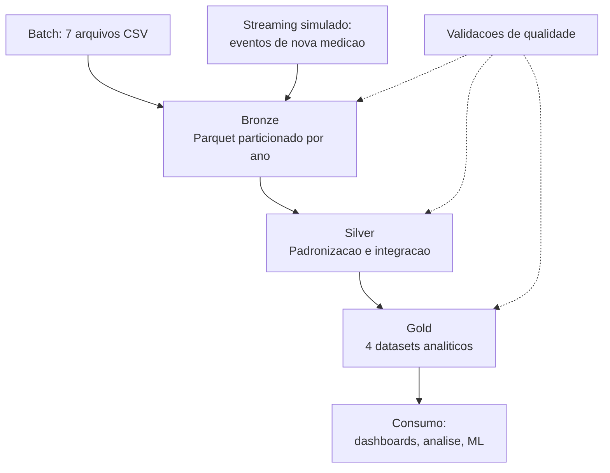

# Fase 4 — Modelagem da Arquitetura

Material de consulta do Tech Challenge Fase 2 — Pipeline Híbrido para Análise da Alfabetização no Brasil.

Este documento cobre os oito conceitos que o desafio exige. Leia, entenda, e depois **reescreva com suas palavras** em `docs/arquitetura.md`. Reescrever é o que fixa o aprendizado; copiar não.

---

## 1. Pipeline de dados

**Conceito.** Uma sequência automatizada de passos que pega dados de onde eles nascem, transforma, e entrega onde serão usados. A palavra-chave é *automatizada*: você roda um comando e todos os passos acontecem na ordem certa, sempre igual.

**Para iniciantes.** É a linha de produção de um laticínio. O leite cru chega no caminhão, passa pela pasteurização, pelo envase, pela rotulagem, e sai como caixinha na prateleira. Ninguém carrega o leite manualmente de uma máquina para outra — a esteira faz isso.

**No seu projeto.** Os CSVs do INEP são o leite cru. A caixinha na prateleira é uma tabela onde um gestor pergunta "quais municípios do Ceará estão abaixo da meta de 2024?" e tem resposta em segundos.

**O contrário de pipeline** é o que quase todo mundo faz no Excel: abrir a planilha, apagar linhas na mão, criar uma coluna, salvar como `versao_final_v3_ok.xlsx`. Funciona uma vez. No mês seguinte ninguém lembra o que foi feito, e refazer é do zero.

---

## 2. Data Lake e Data Warehouse

**Data Lake** — repositório que guarda arquivos de qualquer formato, do jeito que chegaram.

**Data Warehouse** — banco de dados estruturado, com tabelas e colunas definidas, otimizado para consultas analíticas.

**Para iniciantes.** O lake é o depósito nos fundos da loja: cabe tudo, caixa aberta, caixa fechada, coisa que você nem sabe o que é. O warehouse é a prateleira da loja: organizada, etiquetada, pronta para o cliente.

**No seu projeto.** A pasta `data/` é o data lake local (depois virá o Cloud Storage). O DuckDB — e depois o BigQuery — faz o papel de warehouse.

**Trade-off para o README.** Lake aceita qualquer coisa e é barato, mas consultar é mais lento e sem garantia de estrutura. Warehouse é rápido e confiável, mas exige definir o formato antes e custa mais. A arquitetura moderna usa os dois — e é exatamente isso que o medalhão faz.

---

## 3. Arquitetura Medalhão

O nome vem das medalhas olímpicas: bronze, prata, ouro — qualidade crescente.

### Bronze — dados crus

Você copia a fonte e guarda. Não corrige nada, nem o erro mais óbvio.

Parece contraintuitivo, e é justamente aí que está o valor: se daqui a duas semanas você descobrir que a regra de limpeza estava errada, você reprocessa a partir da Bronze. Se tivesse "consertado" na entrada, o dado original estaria perdido para sempre.

**Para iniciantes.** É o negativo da foto. Você nunca risca o negativo — faz cópias e edita as cópias.

### Silver — dados tratados

Aqui acontece o trabalho pesado. No seu projeto especificamente:

- padronizar `rede`, que é texto nas metas ("Pública", "Municipal") e número nos resultados (0, 2, 3, 5)
- converter `id_municipio` de inteiro para string, senão quebra o join com bases do IBGE
- renomear colunas ambíguas (`taxa_alfabetizacao` existe nos dois lados com sentidos diferentes)
- **integrar** as bases

É a camada mais difícil e onde toda a sujeira aparece de uma vez.

### Gold — dados analíticos

Tabelas desenhadas para responder perguntas específicas. Ninguém faz `JOIN` aqui, só lê.

### A regra de ouro

Cada camada é gravada num diretório próprio e **nenhuma sobrescreve a anterior**. Se a Gold der problema, você reprocessa a partir da Silver sem tocar na fonte.

---

## 4. Batch e Streaming

**Batch** — processar um lote acumulado, de tempos em tempos.

**Streaming** — processar evento por evento, assim que chegam.

**Para iniciantes.** Batch é a máquina de lavar: você junta a roupa da semana e lava tudo de uma vez. Streaming é lavar a louça conforme suja.

| | Batch | Streaming |
|---|---|---|
| Custo | Menor | Maior |
| Complexidade | Menor | Maior |
| Latência | Horas ou dias | Segundos |
| Reprocessamento | Fácil | Difícil |

Batch é o padrão. Streaming se justifica quando a decisão não pode esperar — fraude em cartão, alerta médico.

**No seu projeto.** Os dados do INEP são publicados uma vez por ano. Batch é a escolha tecnicamente correta para tudo. O streaming existe porque o desafio exige demonstrar o conceito, e faremos uma **simulação**: um script produtor gerando eventos de "novas medições" e um consumidor ingerindo na Bronze.

Explique essa decisão no README — mostrar que você sabe quando *não* usar uma tecnologia vale tanto quanto saber usá-la.

---

## 5. Qualidade de dados

Verificações automáticas que rodam entre as camadas e falham alto quando algo está errado.

**Para iniciantes.** É o controle de qualidade na linha de produção. Uma caixinha mal vedada é detectada e retirada — não vai para a prateleira e não descobrimos pelo cliente reclamando.

**O que já sabemos que precisa ser testado nas suas bases:**

| Problema encontrado | Onde | Regra a implementar |
|---|---|---|
| `rede` texto vs. número | metas vs. resultados | Padronizar antes do join |
| DF e RR ausentes | resultado por UF (25 de 27) | Alertar, não descartar |
| 198 municípios sem meta | 5.550 vs. 5.352 | `LEFT JOIN` e sinalizar |
| `proporcao_aluno_nivel_*` 100% nula em 2023 | resultados | Documentar como mudança de metodologia |
| `meta_alfabetizacao_2024` parcialmente nula | metas | Usar trajetória 2025–2030 |
| `id_municipio` como inteiro | resultados | Converter para string |

Não há duplicidade em nenhuma tabela pela chave natural — isso já foi verificado.

---

## 6. FinOps

Prática de tratar custo de nuvem como responsabilidade de quem constrói, não só de quem paga a conta.

**Para iniciantes.** É a diferença entre deixar todas as luzes acesas porque "a conta é do prédio" e apagar o que não está usando.

**Seus três argumentos para o README:**

1. **Parquet** — guarda dados por coluna e comprimido. Seus 2,8 MB de CSV devem cair para menos de 600 KB. Serviços de nuvem cobram por byte lido: ler menos é pagar menos.
2. **Particionamento por ano** — uma consulta sobre 2024 lê só a pasta de 2024 e ignora o resto.
3. **Não usar Spark nem Kafka gerenciado** para 3 MB de dados — seria alugar um caminhão para carregar uma caixa de sapatos. Decisão deliberada, não omissão.

---

## 7. Os quatro datasets da camada Gold

| Dataset | Pergunta que responde | Fonte |
|---|---|---|
| `gold_indicador_municipio` | Como está a alfabetização em cada município? | Resultado municipal + dimensão |
| `gold_indicador_uf` | Como está cada estado? | Resultado UF + dimensão |
| `gold_meta_vs_resultado` | Quem está acima ou abaixo da meta, e por quanto? | Resultado + meta |
| `gold_evolucao_temporal` | O indicador melhorou ou piorou de 2023 para 2024? | Resultado, comparando anos |

O terceiro é o mais valioso politicamente — é ele que responde "onde investir". E é o que mais exige cuidado: os 198 municípios sem meta precisam aparecer marcados como *sem meta definida*, **nunca como meta zero**.

---

## 8. Diagrama da pipeline (Mermaid)

Cole isto no seu README. O GitHub renderiza Mermaid automaticamente.

---

## Entregável desta fase

1. Criar a branch: `git checkout -b docs/arquitetura`
2. Escrever `docs/arquitetura.md` **com suas palavras**
3. `git add docs/arquitetura.md`
4. `git commit -m "docs: documenta arquitetura medalhao e conceitos base"`
5. `git push -u origin docs/arquitetura`
6. Abrir o Pull Request no GitHub e fazer o merge

Esse é o primeiro ciclo completo de branch + PR — evidência de uso de Git que o desafio avalia explicitamente.

---

## Próxima fase

**Fase 5 — Construção da camada Bronze.** Um script Python que lê os CSVs e grava em Parquet particionado, explicado linha por linha.

**Pré-requisitos:** os 5 CSVs em `data/raw/` e o repositório publicado no GitHub.